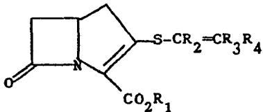
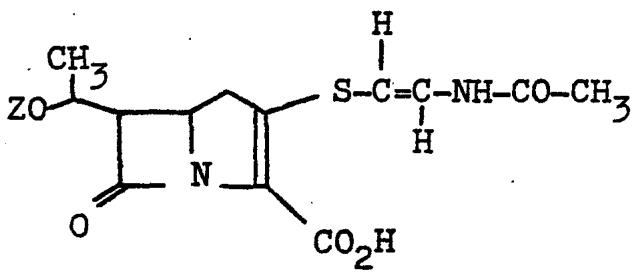
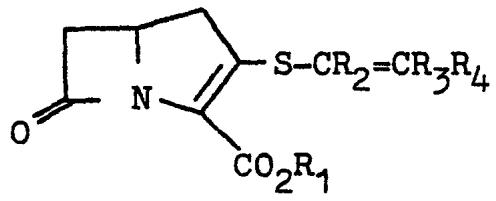
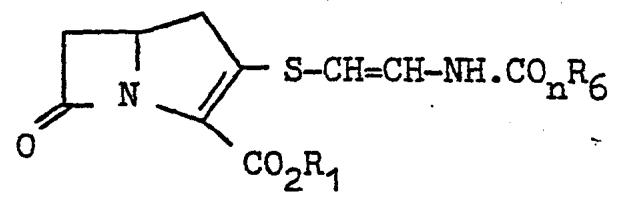
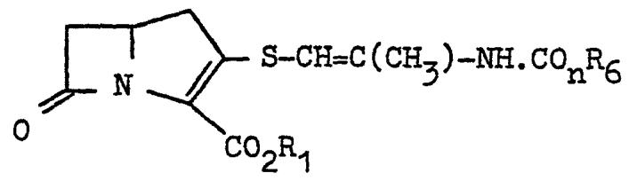
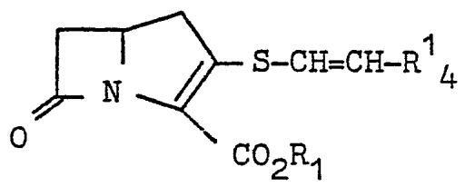
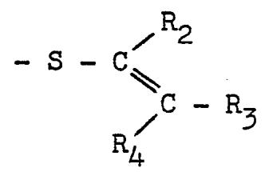
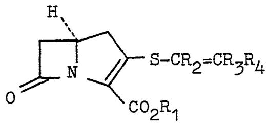
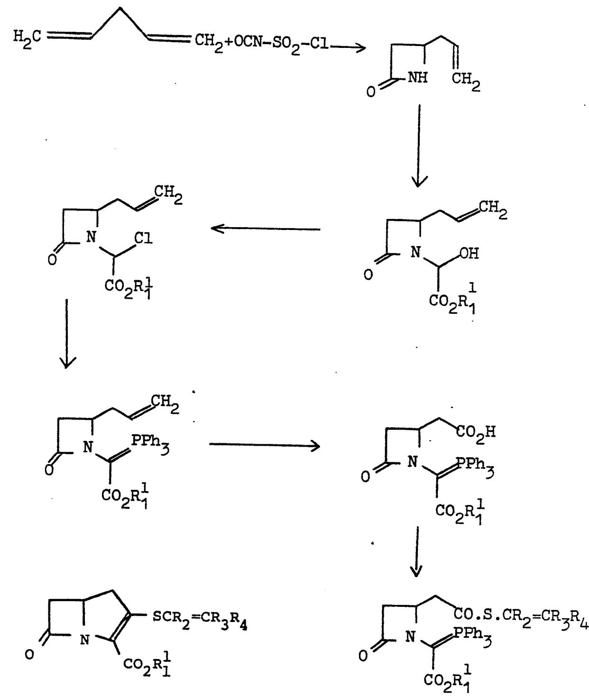
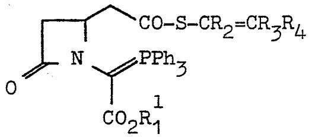

?

# EUROPEAN PATENT APPLICATION

?

? Application number: 78300873.3

Date offiling:20.12.78

③Priority:19.01.78 GB 216678 14.03.78 GB 998578

Date of publication of application: 05.09.79 Bulletin 79/18

Designated contracting states: BE CH DE FR GB NL

Applicant: BEECHAM GROUP LIMITED Beecham House Great West Road Brentford, Middlesex(GB)

int.Ci.2: C 07 D 487/04 A 61_K 31/40,C 07 C 149/24 //C07D205/08,C07F9/65, C07F1/10,C07C149/20, C07C149/18,C07D327/06, (C07D487/04,209/00,205/00), (A61K31/40,31/43)

2 inventor: Ponsford, Roger John 5 Copse Close Wimblehurst Park Horsham Sussex(GB)

? Inventor: Baxter, Andrew John Gilby 3 Albina Garth Medon Hull N. Humberside(GB)

② Inventor: Southgate, Robert 7 Tillets Lane Warnham West Sussex(GB)

2 inventor: Roberts,Patricia Margaret 15 Bakehouse Road Horiey Surrey(GB)

C4) Representative: Cole, William Gwyn et al, Beecham Pharmaceuticals Yew Tree Bottom Road Epsom Surrey KT18 5XQ(GB)

@ Beta-iactam antibiotics, a process for their preparation and their use in pharmaceutical compositions.

? The present invention provides the antibacterial agents ofthe formula (l):

(II）  

Wherein R1 is a group such that CO2R1 is a carboxylic acid group or a salt thereof or_is a group of the formula CO2Rl wherein Rlis a group such that CO2Ris an ester group. 'R2 is a hydrogen atom or a lower alkyl group; R3 is a hydro-'gen atom or a lower alkyl group; and R4 is a phenyi group or a phenyl group substituted by one or two groups selected from fluorine, chlorine, OR5, NH.CO.Rs,NH.CO2R5 or CO2R5 where Rs is a iower alkyi or benzyl group or R4 is a hydrogen atom Or lower alkyl group or R. is a CO2Rs group where Rs is a lower alkyl group or benzyl group or R4 is a NH.COnRe group where Rs is a lower alkyl group, a phenyl group or a phenyl group substituted by one or two halogen atoms, lower alkyl or iower alkoxyl groups; and n is 1 or 2. A process for their :preparation and their use in pharmaceutical compositions is also described.

British Patent No. 1,483,142 discloses that the compound of the formula (I):

(I)

wherein Z is HozS and its salts may be obtained by fermentation of strains of Streptomyces olivaceus. Danish Patent Application No. 984/78 discloses that the compound of the formula (I) wherein Z is H and its salts could also be obtained by fermentation of strains of that organism. We have found that a distinct class of synthetic antibacterial agents which contain a β-lactam ring fused to a pyrroline ring may be prepared.

Accordingly the present invention provides the compounds of the formula (II):

(II)

wherein $\mathtt { R _ { 1 } }$ is a group such that $\mathtt { c o } _ { 2 } \mathtt { R } _ { 1 }$ is a carboxylic acid group or a salt thereof or is a group of the formula $\mathsf { c o } _ { 2 } \mathtt { R } _ { 1 } ^ { 1 }$ wherein $\mathtt { R } _ { \mathtt { I } } ^ { \mathtt { I } }$ is a group such that $\mathsf { c o } _ { 2 } \mathsf { R } _ { 1 } ^ { 1 }$ is. an ester group, $\mathtt { R } _ { 2 }$ is a hydrogen atom or a lower alkyl group; $\mathtt { R } _ { 3 }$ is a hydrogen atom or a lower alkyl group; and $\mathtt { R _ { 4 } }$ is a phenyl group or a phenyl group substituted by one or two groups selected from fluorine， chlorine, ${ \tt O R } _ { 5 }$ ，NH.CO. $R _ { 5 }$ ，NH. $\mathtt { c o } _ { 2 } \mathtt { R } _ { 5 }$ or $\mathtt { c o } _ { 2 } \mathtt { R } _ { 5 }$ where $\mathtt { R } _ { 5 }$ is a lower alkyl or benzyi group or $R _ { 4 }$ is a hydrogen atom or lower alkyl group or $\mathtt { R _ { 4 } }$ isa $C O _ { 2 } R _ { 5 }$ group where $R _ { 5 }$ is a lower alkyl group or benzyl group or $\mathtt { R _ { 4 } }$ is a NH. ${ \tt C O } _ { \tt n } \tt R _ { 6 }$ group where $\mathtt { R _ { 6 } }$ is a lower alkyl group， a phenyl group or a phenyl group substituted by one or two halogen atoms， lower alkyl or lower alkoxyl groups; and n is 1 or 2.

When used herein the term "lower"

means the group contains up to 4 carbon atoms.

Aptly $\mathtt { c o } _ { 2 } \mathtt { R } _ { 1 }$ in the compounds of the formula (II) represents a carboxylic acid group or a salt thereof.

Aptly ${ \tt c o } _ { 2 } \tt R _ { 1 }$ in the compounds of the formula (II) represents an ester group $\mathsf { c o } _ { 2 } \mathsf { R } _ { 1 } ^ { 1 }$

Particularly suitable lower alkyl

groups include the methyl and ethyl groups. A preferred lower alkyl group is the methyl group.

atom.

$$
\mathtt { R } _ { 2 }
$$

Favoured values for $R _ { 3 }$ include the hydrogen atom and the methyl group.

A preferred value for $R _ { 3 }$ is the hydrogen atom.

Suitably $\mathtt { R } _ { 4 }$ is a phenyl group or a phenyl group substituted by one or two groups selected from fluorine， chlorine, $O R _ { 5 }$ $\mathtt { N H . C O . R _ { 5 } }$ ， $N _ { 1 } I _ { 0 } = 2 ^ { R _ { 5 } }$ or $C O _ { 2 ^ { R _ { 5 } } }$ where $R _ { 5 }$ is a lower alkyl or benzyl group or $R _ { 4 }$ is a hydrogen atom or lower alkyl group or $\mathtt { R } _ { 4 }$ isa $c o _ { 2 ^ { R _ { 5 } } }$ group where $R _ { 5 }$ is a lower alkyl or benzyl group.

Suitably $\mathtt { R } _ { 4 }$ isa $\mathbb { N H . C O } _ { \mathtt { n } ^ { \mathtt { h } } 6 }$ group where. $a _ { 6 }$ isa lower alkyl group，a phenyl group or a phenyl group substituted by one or two halogen atoms，lower alkyl or lower alkoxyl groups; and n is 1 or 2.

From the foregoing it will be realised that certain favoured compounds of this invention include those of the formula (III) and (IV):

（III）

(Iv）

wherein $R _ { 1 }$ ,n and $n _ { 6 }$ are as defined in relation to formula (II）.

Most suitably n is 1.

Similarly it will be realised that other favoured compounds of this invention include those of the formula (v):

(v）

where $R _ { 1 }$ is as defined in relation to formula (II) and ${ \tt R } _ { \mathrm { ~ 4 ~ } } ^ { 1 }$ is a group $\mathtt { R } _ { 4 }$ as defined in relation to formula (II) excluding the NH. $C O _ { \tt m } R _ { 6 }$ group.

Suitably $\ R ^ { 1 } { } _ { 4 }$ is a phenyl group optionally monosubstituted.

Suitable groups $R _ { 4 }$ include the phenyl，p-chlorophenyl，m-chlorophenyl，p-nitrophenyl，m-nitrophenyl, p-ethoxycarbonylphenyl， p-fluorophenyl， p-methylphenyl, p-methoxyphenyl and 1ike groups.

Other suitable groups $\mathtt { R } _ { 4 }$ include the hydrogen atom and the methyl and ethyl groups.

Yet other suitable groups $\mathtt { R } _ { 4 }$ include those of the formula $C O _ { 2 ^ { R _ { 7 } } }$ where $n _ { 7 }$ is methyl，ethyl，phenyl or benzyl.

It will be realised that the compounds of the formula (II) may be in either of two geometrical forms about the exocyclic double bond as shown in the sub-formulae (a)and (b） thus:

(b)

Both separated geometrical isomers and mixtures of said isomers are within the scope of this invention.

In the compounds of the formulae (II） - (v) $\mathtt { c o } _ { 2 } \mathtt { R } _ { \mathtt { I } }$ is favourably a carboxylic acid group or a salt thereof. Most favourably $\mathsf { c o } _ { 2 } \mathsf { R } _ { 1 }$ represents a salted carboxylic acid group wherein the cation is pharmaceutically acceptable. Preferred pharmaceutically acceptable salts include the sodium， potassium， calcium and magnesium salts of which the sodium salt is particularly preferred.

Suitable groups $R _ { 1 } ^ { 1 }$ include alkyl groups of up to 12 carbon atoms，alkenyl groups of up to 12 carbon atoms, alkynyl groups of up to 12 carbon atoms， phenyl or benzyl groups or any aforesaid inertly substituted by lower alkoxyl,lower acyloxyl，halogen,nitro or the like group. Used herein 'inertly substituted' means that the resulting group is stable and will not undergo rapid decomposition.

Particularly suitable groups $R _ { 1 } ^ { 1 }$ include lower alkyl groups optionally substituted by lower alkoxyl group; the benzyl group optionally substituted by lower alkoxyl, nitro，chloro or the like; and those groups which are known to give rise to rapid in-vivo hydrolysis in penicillin esters.

Certain preferred groups $R _ { 1 } ^ { 1 }$ include the methyl，ethyl, methoxymethyl，2-methoxyethyl，benzyl，methoxybenzyl and the like. Other preferred groups $a _ { 1 } ^ { 1 }$ include those which give rise to in-vivo hydrolysable esters such as the acetoxymethyl， pivaloyloxymethyl，α-ethoxycarbonyloxyethyl, phthalidyl and the like.

An especially preferred group $R _ { 1 } ^ { I }$ is the phthalidyl group.

A further especially preferred group $R _ { 1 } ^ { 1 }$ is the p-nitrobenzyl group.

The compounds of the formula (II) most suitably have the configuration shown in formula (vI):

(VI)

wherein $R _ { 1 }$ ， $R _ { 2 }$ ， $R _ { 3 }$ and $R _ { 4 }$ are as defined in relation to formula (II).

Thus the compounds of the invention are preferably those having the S- configuration at C-5. However, mixtures of the compounds·of the formula (vI) with their enantiomers， for example the 5Rs compounds，are also included within this invention.

A reaction sequence leading to the compounds of this invention is as follows:

The process provided by this invention for the preparation of the compounds of the formula (II) comprises the ring closing elimination of the elements of triphenylphosphineoxide from a compound of the formula (vII):

  
(VII)

wherein $R _ { 1 } ^ { I }$ ， $\mathtt { R } _ { 2 }$ ， $R _ { 3 }$ and $\mathtt { R } _ { 4 }$ are as defined in relation to formula (II);and thereafter cleaving the ester to yield the carboxylic acid or its salt.

The ring closure is normally brought about by heating the compound of the formula (vII） in an inert solvent; for example temperatures of $9 0 - 1 2 0 ^ { \circ }$ and more suitably $1 0 0 - 1 1 0 ^ { \circ } C$ may be employed in a solvent such as toluene or the like. The reaction is best carried out under dry conditions under an inert gas.

The ester of the compound (II) produced may be isolated by any standard method such as fractional crystallisation or chromatography. We have found that it is most convenient to separate the desired product by column chromatography.

Any convenient ester may be used in the process of this invention. Since it is frequently desirable to form a salt of compounds (II)， the ester employed is preferably one which is readily converted to the parent acid or its salt by mild methods of hydrogenolysis. In a further aspect therefore the invention includes a process for preparing a salt or free acid of a compound (II) which process comprises de-esterifying an ester of a compound of formula (II). Particularly suitable esters for use in this process include benzyl esters，optionally substituted in the para position

by a lower alkoxy，or nitro group or a halogen atom.

A preferred ester for use in this process is the p-nitrobenzyl ester.

Esters of compounds (II) may be de-esterified by conventional methods of hydrogenolysis.

Suitable methods include hydrogenation in the presence of a transition metal catalyst. The pressure of hydrogen used in the reaction may be low，medium or high but in general an approximately atmospheric or slightly super-atmospheric pressure of hydrogen is preferred. The transition metal catalyst employed is preferably palladium on charcoal or on calcium carbonate. The hydrogenation may be effected in a suitable solvent in which the ester is soluble such as aqueous dioxan or the like. If this hydrogenation is carried out in the presence of a base then a salt of compounds (II) is produced. Suitable bases for inclusion include ${ \tt N a H C O } _ { 3 }$ $\mathtt { K H C O } _ { 3 }$ / $\aleph \mathsf { a } _ { 2 } \mathsf { C o } _ { 3 } , \aleph _ { 2 } \mathsf { C o } _ { 3 } , \mathsf { C a C O } _ { 3 }$ $\yen 123$ $\mathtt { L i H C O } _ { 3 }$ ， $\mathtt { N F } _ { 4 } \mathtt { O C O C F } _ { 3 }$ and the like. If no base is present then hydrogenation leads to the preparation of an acid within formula (II) which may then be neutralised if desired to yield a salt. Suitable bases which may be used to neutralise acids within formula (II) include LiOH，NaOH, ${ \tt N a H C O } _ { 3 }$ ，KOH，Ca $\left( \mathsf { O } \bar { \mathbf { H } } \right) _ { 2 }$ and Ba $\left( \mathsf { O H } \right) _ { 2 }$

The salts of acids (II) may be converted to esters in conventional manner， for example by reaction with a reactive halide such as bromophthalide in solution in dimethylformamide or like solvent.

The compound of the formula (vII） may be prepared by the reaction of a corresponding compound of the formula (VIII):