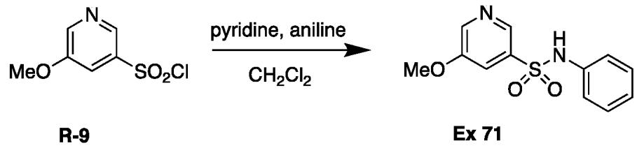
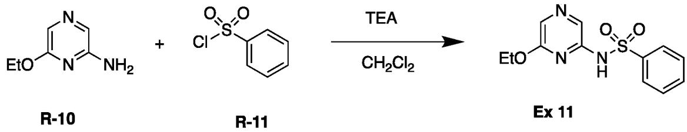
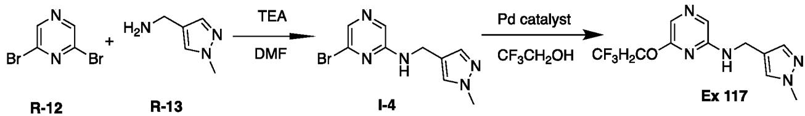

[0293] Synthetic Example E: Synthesis of Example 71

[0294] Aniline (22 mg, 0.241 mmol) and pyridine (0.097 mL,1.20 mmol) are suspended in CHCl (5 mL) and cooled to $0 ~ ^ { \circ } \mathbf C$ and stirred for 5 minutes. To the reaction mixture R-9 (50 mg, 0.24l mmol) is added and the reaction mixture is stirred for 1O minutes. The reaction mixture is concentrated in vacuo. The crude product is purified by preparative HPLC to afford Example 71 (22 mg, 35%).

[0295] Synthetic Example F: Synthesis of Example 11

[0296] R-10 (50 mg, 0.359 mmol), R-11 (69 uL, 0.539 mmol) are dissolved in CHCl (2 mL). Triethylamine (0.15 mL,1.08 mmol) is added and the reaction mixture is stirred at room temperature for 17 hrs. The mixture is washed with water (2 mL) then passed through a Telos phase separator. Additional $\mathrm { C H } _ { 2 } \mathrm { C l } _ { 2 }$ (2 mL) is passed through the phase separator. The combined organic layers are concentrated in vacuo to give the crude product. The crude material is purified by preparative HPLC to afford Example 11 (6.0 mg, 5.9%).

[0297] The following examples are prepared in similar fashion from the appropriate aniline and sulphonyl chloride: Examples 17, 195, and 207-209.

Synthetic Example G: Synthesis of Example 23

[0299] R-12 (5.00 g, 20.6 mmol), riethylamine (8.6 mL, 61.8 mmol) and R-13 (2.29 g, 20.6 mmol) are suspended in DMF (1O mL). The reaction mixture is sealed under a nitrogen atmosphere and stirred at $8 0 ~ ^ { \circ } \mathrm { C }$ for 1 hour then cooled to room temperature and partitioned